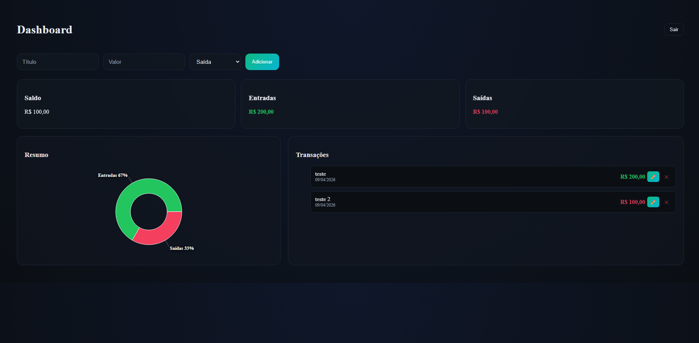

# 💸 Dashboard Financeiro Pro

Aplicação web moderna para gerenciamento de finanças pessoais, com foco em experiência do usuário, performance e interface profissional.

---

## 🚀 Preview

🔗 https://dashboard-financeiro-react.vercel.app/

---

## ✨ Funcionalidades

- ✅ Adicionar, editar e remover transações
- 💰 Máscara de moeda brasileira (R$) em tempo real
- 📊 Gráfico interativo (Recharts)
- 🔄 Atualização dinâmica de saldo, entradas e saídas
- ✏️ Edição inline de transações
- 🔔 Notificações em tempo real (Toast)
- 🎯 Feedback visual e microinterações
- 📱 Layout totalmente responsivo

---

## 🧠 Tecnologias Utilizadas

- ⚛️ React
- 🟦 TypeScript
- ⚡ Vite
- 🐻 Zustand (gerenciamento de estado)
- 🎬 Framer Motion (animações)
- 📊 Recharts (gráficos)
- 🔔 React Hot Toast (notificações)
- 🎨 CSS3 (estilização customizada)
- 🧰 Git & GitHub

---

## 📸 Demonstração



---

## 🛠️ Como rodar o projeto

```bash
# Clonar repositório
git clone https://github.com/lucasSperb/dashboard-financeiro-react

# Entrar na pasta
cd dashboard-financeiro

# Instalar dependências
npm install

# Rodar projeto
npm run dev